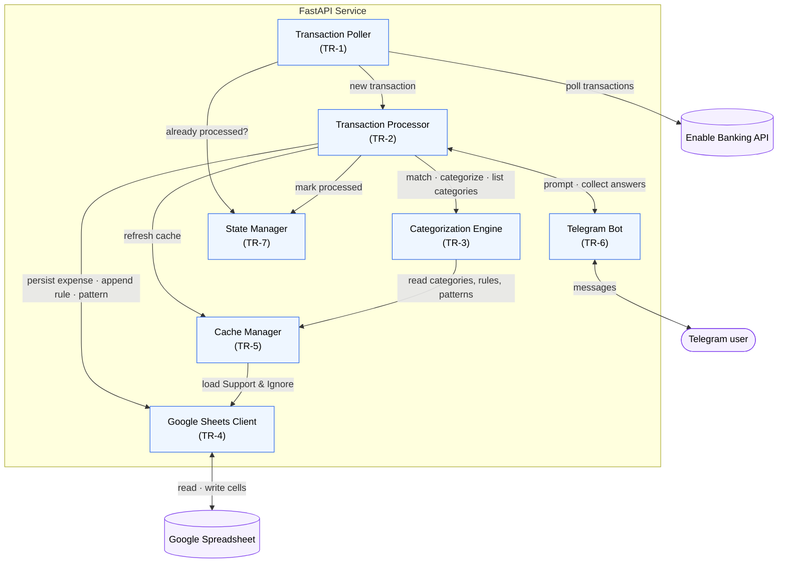

# System Architecture

## Overview

The Expense Categorization Assistant is a lightweight service that periodically retrieves new Revolut transactions through an Open Banking provider, categorizes them using merchant rules stored in Google Sheets, and interacts with the user through Telegram whenever manual intervention is required.

The application is intentionally designed to avoid a traditional database. Google Sheets acts as the system of record, while the application maintains only transient caches and a small runtime state file for idempotency.

---

# High-Level Architecture



**Legend:** **blue** nodes are the application's internal components (each has its own
TR); **purple** nodes are external systems. Arrows are conceptual interactions
labelled with intent, not implementation. The **Transaction Processor** is the sole
orchestrator: it drives both the automatic-categorization flow (FR-5) and the
interactive unknown-merchant workflow (FR-6→8), using the **Telegram Bot** purely as a
messaging surface (prompt the user, collect answers). All spreadsheet access goes
through the single **Google Sheets Client**, the only component that touches the
spreadsheet.

---

# Components

## 1. Transaction Poller

### Responsibilities

- Poll Enable Banking at a configurable interval.
- Retrieve newly settled debit transactions.
- Ignore transactions already processed.
- Pass new transactions to the Transaction Processor.

### Inputs

- Enable Banking API

### Outputs

- New transaction objects

---

## 2. Transaction Processor

The Transaction Processor orchestrates the entire workflow.

### Responsibilities

- Check whether the transaction has already been processed.
- Check ignore patterns.
- Check merchant rules.
- Trigger Telegram interaction when required.
- Persist categorized expenses.
- Update runtime state.

---

## 3. Categorization Engine

The Categorization Engine contains all business logic related to merchant matching.

### Responsibilities

- Match transaction descriptions against merchant rules.
- Generate merchant substring suggestions.
- Generate ignore pattern suggestions.
- Normalize merchant descriptions.
- Determine the final category assignment.

This component is completely independent of Telegram and Google Sheets.

---

## 4. Google Sheets Client

The Google Sheets Client is responsible for all spreadsheet operations.

### Responsibilities

- Load the Support sheet.
- Load the Ignore patterns sheet.
- Append merchant substrings.
- Append ignore patterns.
- Append expenses to monthly sheets.

The rest of the application never interacts with Google Sheets directly.

---

## 5. Cache Manager

The Cache Manager maintains an in-memory representation of spreadsheet data.

### Cached Objects

- Primary Categories
- Secondary Categories
- Merchant Rules
- Ignore Patterns

### Cache Refresh

The cache is rebuilt:

- at application startup;
- after merchant rule updates;
- after ignore pattern updates.

The cache is never persisted.

---

## 6. Telegram Bot

The Telegram Bot is responsible for all user interaction.

### Responsibilities

- Notify the user of unknown transactions.
- Present available actions.
- Collect category selections.
- Collect merchant substring selections.
- Collect ignore pattern selections.

The Telegram Bot never performs business logic itself.

It delegates all decisions to the Categorization Engine.

---

## 7. State Manager

The State Manager guarantees idempotent processing.

### Responsibilities

- Load processed transaction identifiers.
- Persist processed transaction identifiers.
- Check whether a transaction has already been processed.

### Persistence

The State Manager stores its data in a lightweight local file.

This file is considered runtime state and is not business data.

---

# Google Spreadsheet

The Google Spreadsheet is the only business data repository.

## Support Sheet

Contains:

- Primary Categories
- Secondary Categories
- Merchant Rules

---

## Ignore patterns Sheet

Contains:

- Ignore Patterns

---

## Monthly Sheets

One sheet per month:

- Jan
- Feb
- Mar
- ...
- Dec

Each sheet stores categorized expenses.

---

# Processing Flow

## Automatic Categorization

```text
Poll transaction
        │
        ▼
Already processed?
        │
   Yes ─────────────► Ignore
        │
       No
        │
        ▼
Matches Ignore Pattern?
        │
   Yes ─────────────►
        │            Mark processed
        │
       No
        │
        ▼
Matches Merchant Rule?
        │
   Yes ─────────────►
        │            Write expense
        │            Mark processed
        │
       No
        │
        ▼
Telegram workflow
```

---

## Telegram Workflow

```text
Unknown transaction

        │
        ▼
Categorize
or
Ignore

```

### Categorize

```text
Primary Category
        │
        ▼
Secondary Category
        │
        ▼
Merchant substring
        │
        ▼
Update Support sheet
        │
        ▼
Refresh cache
        │
        ▼
Write expense
        │
        ▼
Mark processed
```

### Ignore

```text
Generate ignore candidates
        │
        ▼
User selects pattern
        │
        ▼
Append Ignore pattern
        │
        ▼
Refresh cache
        │
        ▼
Mark processed
```

---

# Runtime Data

The application maintains two kinds of runtime data.

## In-memory Cache

Contains:

- Merchant Rules
- Ignore Patterns
- Categories

Purpose:

- Reduce Google Sheets API calls.
- Improve matching performance.

---

## State File

Contains:

- Processed Transaction IDs

Purpose:

- Guarantee idempotent processing.
- Prevent duplicate expense insertion.
- Prevent duplicate Telegram notifications.

---

# Design Principles

The architecture follows the following principles:

- **Google Sheets is the single source of truth** for all business data.
- **No relational database** is required.
- **Business logic is isolated** from infrastructure concerns.
- **Telegram is a user interface only**, not a business logic component.
- **Caching is disposable** and rebuilt from Google Sheets whenever necessary.
- **Idempotency is guaranteed** through a lightweight local state file.
- **All spreadsheet writes are append-only**, except for updates to the Merchant Rules column in the Support sheet.
- **The system is designed for a single user and a single yearly spreadsheet.**