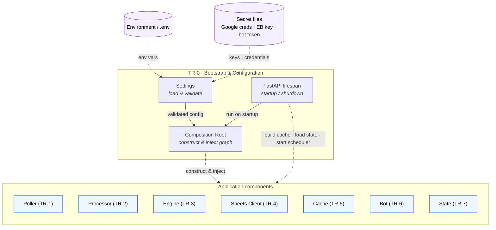

# TR-0. Application Bootstrap & Configuration

> Status: **Implemented.** The Composition Root, FastAPI lifespan and the
> `expenses-serve` entry point wire and run the full application end-to-end
> (automatic path). The consent-expiry watchdog is in place. The FR-6→8 interactive
> Telegram workflow is still a later TR-2 slice (the bot currently logs inbound updates).

## Traceability
- Functional requirements: FR-2 (configurable spreadsheet identifier, dynamic config load)
- Non-functional requirements: NFR-1 (Python/FastAPI), NFR-7 (single Docker container), NFR-8 (uv)
- Architecture: application composition (spans all components in [architecture.md](../architecture.md))

## Purpose & Scope
Defines how the FastAPI application is assembled, configured and started: settings
sourcing, dependency wiring between components, lifecycle (startup/shutdown) hooks,
and packaging as a single Docker container.

## System Decomposition
Unlike the other components, TR-0 has **no runtime data flow** — it is the
**Composition Root**. Internally: **Settings** (load & validate config), the
**Composition Root** proper (construct & inject the object graph), and the FastAPI
**lifespan** (run the root on startup, trigger initial actions, tear down). Its arrows
are *construction and configuration*, not runtime calls; at runtime the components
interact with each other as shown in [architecture.md](../architecture.md).

**Legend:** boxes inside the *TR-0* frame are the bootstrap's internal parts; **purple**
nodes are external config/secret sources; **blue** nodes are the application components
(each its own TR). **Dashed** arrows are construction/config/lifecycle, **not** runtime
calls — TR-0 wires the graph then steps out of the runtime path. The single dashed
arrow into the *Application components* group stands for constructor injection into all
seven (per the Composition Root decision).

## Responsibilities
- Load runtime configuration (env vars / config file) and validate it at startup.
- Compose and inject the concrete components (Poller, Processor, Engine, Sheets Client, Cache, Bot, State).
- Trigger startup actions: initial cache build (FR-14), state-file load (FR-13), poller start (FR-1).
- Expose FastAPI app (health endpoint; Telegram webhook if webhook mode is chosen — see TR-6).

## Design Decisions
- **Configuration mechanism (decided):** all config is env vars with the
  `EXPENSES_` prefix, loaded (and optionally from `.env`) by
  [`Settings`](../../src/expenses/config.py) (pydantic-settings), validated at
  startup. Secrets are **file paths**, not inline values: the Google service-account
  JSON and the Enable Banking private key live under `secrets/` (gitignored) and are
  referenced by path; only the Telegram token and account UID are inline env values.
- **Config vs. spreadsheet (decided):** the spreadsheet holds the *domain* data
  (categories, merchant rules, ignore patterns — FR-2); settings hold only
  *deployment* data (ids, paths, intervals, credentials). The one grey area —
  stop words (FR-9/10) — is kept in code
  ([`stopwords.py`](../../src/expenses/categorization/stopwords.py)), editable but not
  an env var: it is matching vocabulary, versioned with the algorithm, not per-deploy
  config. (Resolves the open question below.)
- **Lifecycle (decided):** the Composition Root runs inside the FastAPI `lifespan`.
  Startup order is **build graph → load state (FR-13) → build cache (FR-14) → start
  Telegram polling → start poll scheduler (FR-1)**; shutdown reverses it (stop
  scheduler → stop bot → close the shared `httpx` client). Telegram runs in the app's
  own event loop via `initialize`/`start`/`updater.start_polling` (not PTB's
  `run_polling`, which would own the loop).
- **Composition Root (decided):** the bootstrap is the application's single
  **Composition Root** — the one module that knows the concrete implementations and
  assembles the whole object graph. Every component receives its collaborators by
  **constructor injection against Protocol *ports*** (Ports & Adapters / Hexagonal);
  nothing constructs its own dependencies. Already realized in TR-1: `ProcessedStore`
  and `TransactionSink` are `Protocol`s in
  [`ports.py`](../../src/expenses/poller/ports.py), and `TransactionPoller` /
  `EnableBankingGateway` take injected constructors — which is what lets the tests
  swap in stubs without Enable Banking credentials.
  - **Manual wiring, no DI container:** for a single-user app, keep it "poor-man's DI"
    (plain constructor calls in this module). A DI framework/container is out of scope.
  - The Composition Root **runs in the FastAPI `lifespan`**: build the graph on
    startup, trigger initial actions (cache build, state load, start scheduler), tear
    down on shutdown.
- **Scheduler (decided):** internal `asyncio` scheduler started from `lifespan`, per
  [TR-1 DD-1](TR-1-transaction-poller.md). No external trigger.
- **Enable Banking consent lifecycle (decided, implemented):** the account UID
  depends on an authorized session that **expires** (`valid_until`; production
  consents ~90 days). When it lapses Enable Banking answers 401/403. The
  [`PollCycle`](../../src/expenses/bootstrap/composition.py) wrapper around
  `poll_once` catches those, sends **one** Telegram notification prompting a re-run of
  `expenses-consent` (deduped, re-armed after the next successful poll), and swallows
  the error so the scheduler keeps looping — recovery is automatic once the user
  re-authorizes and updates `EXPENSES_EB_ACCOUNT_UID`. Non-auth HTTP errors propagate
  to the scheduler's own log-and-continue guard. A missing UID at startup is a config
  error and fails loud.

## Data Model / Contracts
The full settings schema lives in [`config.py`](../../src/expenses/config.py):
Enable Banking (base url, application id, private-key path, account UID, status
filter, redirect url), polling (interval, lookback, expected currency), Google Sheets
(credentials path, spreadsheet id, Support/Ignore tab names), state-file path, HTTP
server host/port, and Telegram (bot token, chat id). Stop words are **not** here — see
the config-vs-spreadsheet decision. The Composition Root exposes an assembled
`Components` dataclass (held on `app.state`) so the lifespan can drive startup/shutdown
and `/health` can report cache size.

## Interfaces
- Inbound: process env, config file, HTTP (health, webhook).
- Outbound: constructs all other components.

## Dependencies
All other TRs depend on this for wiring; this depends on none of them at design time.

## Risks & Assumptions
- Assumes single-user, single-yearly-spreadsheet deployment (architecture design principle).
- Secret management in a single container needs a decision (mounted file vs. env).

## Open Questions
- ✅ Stop words (FR-9/10) — resolved: they live in code
  ([`stopwords.py`](../../src/expenses/categorization/stopwords.py)), not settings or the
  spreadsheet (matching vocabulary, versioned with the algorithm).
- ✅ Long-running app with internal scheduler vs. external trigger — resolved: internal async scheduler ([TR-1 DD-1](TR-1-transaction-poller.md)).
- ✅ Enable Banking **consent expiry** surfacing/recovery — resolved: `PollCycle`
  watchdog notifies (deduped) + swallows so polling auto-recovers. See Design Decisions.

## Implementation
Package [`src/expenses/bootstrap/`](../../src/expenses/bootstrap/):
- [`composition.py`](../../src/expenses/bootstrap/composition.py) — `build_components()`
  (the Composition Root: constructs & injects the whole graph), the `Components`
  dataclass, and `PollCycle` (consent-expiry watchdog).
- [`app.py`](../../src/expenses/bootstrap/app.py) — `create_app()` FastAPI factory +
  `lifespan` (startup/shutdown ordering, Telegram in-loop start/stop) + `/health`.
- [`cli.py`](../../src/expenses/bootstrap/cli.py) — `expenses-serve` runs the app under
  uvicorn (host/port from settings).

Run the whole app: `uv run expenses-serve`. Tests in
[`tests/test_bootstrap.py`](../../tests/test_bootstrap.py) cover the `PollCycle`
consent-expiry behaviour (notify-once, re-arm after success, non-auth errors
propagate). Full lifespan wiring needs live Google/Enable Banking credentials and is
exercised by running the server rather than in unit tests.
