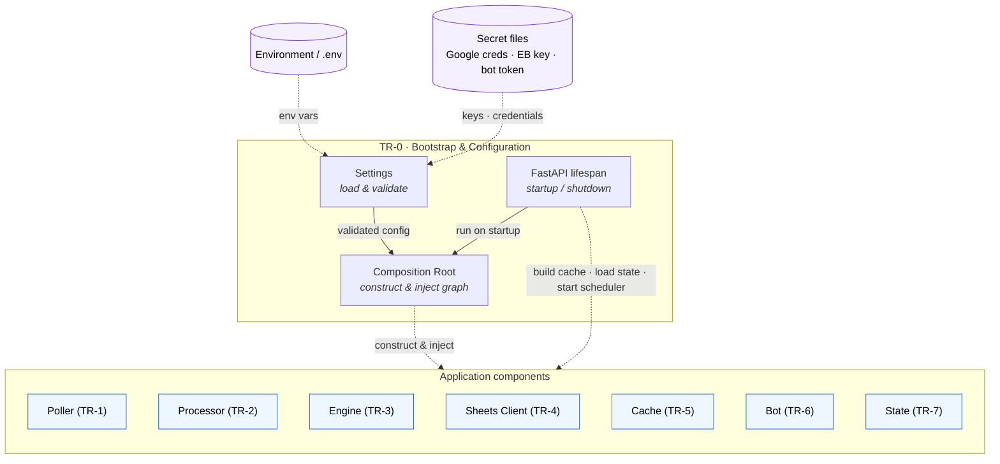

# TR-0. Application Bootstrap & Configuration

> Status: Draft skeleton.

## Traceability
- Functional requirements: FR-2 (configurable spreadsheet identifier, dynamic config load)
- Non-functional requirements: NFR-1 (Python/FastAPI), NFR-7 (single Docker container), NFR-8 (uv)
- Architecture: application composition (spans all components in [architecture.md](../architecture.md))

## Purpose & Scope
Defines how the FastAPI application is assembled, configured and started: settings
sourcing, dependency wiring between components, lifecycle (startup/shutdown) hooks,
and packaging as a single Docker container.

## System Decomposition
Unlike the other components, TR-0 has **no runtime data flow** — it is the
**Composition Root**. Internally: **Settings** (load & validate config), the
**Composition Root** proper (construct & inject the object graph), and the FastAPI
**lifespan** (run the root on startup, trigger initial actions, tear down). Its arrows
are *construction and configuration*, not runtime calls; at runtime the components
interact with each other as shown in [architecture.md](../architecture.md).

**Legend:** boxes inside the *TR-0* frame are the bootstrap's internal parts; **purple**
nodes are external config/secret sources; **blue** nodes are the application components
(each its own TR). **Dashed** arrows are construction/config/lifecycle, **not** runtime
calls — TR-0 wires the graph then steps out of the runtime path. The single dashed
arrow into the *Application components* group stands for constructor injection into all
seven (per the Composition Root decision).

## Responsibilities
- Load runtime configuration (env vars / config file) and validate it at startup.
- Compose and inject the concrete components (Poller, Processor, Engine, Sheets Client, Cache, Bot, State).
- Trigger startup actions: initial cache build (FR-14), state-file load (FR-13), poller start (FR-1).
- Expose FastAPI app (health endpoint; Telegram webhook if webhook mode is chosen — see TR-6).

## Design Decisions
_TBD._ Candidate topics:
- Configuration mechanism and precedence (env vars vs. file); secret handling (Google credentials, Telegram token, Enable Banking credentials).
- What is configuration vs. what lives in the spreadsheet (FR-2 says categories/rules come from Sheets).
- Application lifecycle: FastAPI `lifespan` for startup/shutdown ordering.
- **Composition Root (decided):** the bootstrap is the application's single
  **Composition Root** — the one module that knows the concrete implementations and
  assembles the whole object graph. Every component receives its collaborators by
  **constructor injection against Protocol *ports*** (Ports & Adapters / Hexagonal);
  nothing constructs its own dependencies. Already realized in TR-1: `ProcessedStore`
  and `TransactionSink` are `Protocol`s in
  [`ports.py`](../../src/expenses/poller/ports.py), and `TransactionPoller` /
  `EnableBankingGateway` take injected constructors — which is what lets the tests
  swap in stubs without Enable Banking credentials.
  - **Manual wiring, no DI container:** for a single-user app, keep it "poor-man's DI"
    (plain constructor calls in this module). A DI framework/container is out of scope.
  - The Composition Root **runs in the FastAPI `lifespan`**: build the graph on
    startup, trigger initial actions (cache build, state load, start scheduler), tear
    down on shutdown.
- **Scheduler (decided):** internal `asyncio` scheduler started from `lifespan`, per
  [TR-1 DD-1](TR-1-transaction-poller.md). No external trigger.
- **Enable Banking consent lifecycle:** the account UID depends on an authorized
  session that **expires** (`valid_until`; production consents ~90 days). When it
  lapses, polling fails with an auth error and must not silently stop — the app should
  detect expiry and notify the user (Telegram, TR-6) to re-run the consent flow
  (`expenses-consent`), rather than dying quietly. Re-auth is interactive by nature.

> A seed of the settings schema is already implemented in
> [`src/expenses/config.py`](../../src/expenses/config.py) for the poller (Enable
> Banking + polling settings); TR-0 will extend it for the other components.

## Data Model / Contracts
_TBD._ Settings schema: spreadsheet id, poll interval, stop words, Telegram chat id, credential locations, state-file path.

## Interfaces
- Inbound: process env, config file, HTTP (health, webhook).
- Outbound: constructs all other components.

## Dependencies
All other TRs depend on this for wiring; this depends on none of them at design time.

## Risks & Assumptions
- Assumes single-user, single-yearly-spreadsheet deployment (architecture design principle).
- Secret management in a single container needs a decision (mounted file vs. env).

## Open Questions
- Which values are "configurable stop words" (FR-9/10) and where do they live — settings or spreadsheet?
- ✅ Long-running app with internal scheduler vs. external trigger — resolved: internal async scheduler ([TR-1 DD-1](TR-1-transaction-poller.md)).
- How should Enable Banking **consent expiry** be surfaced and recovered (notify + re-run `expenses-consent`)? See Design Decisions.
