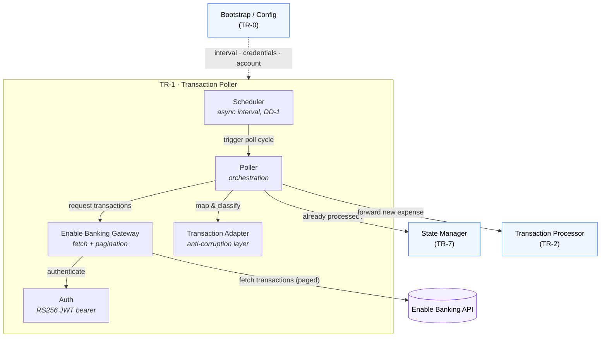

# TR-1. Transaction Poller

> Status: Specified (v1) and **implemented** (see [Implementation](#implementation)). Schema grounded in the Enable Banking API reference; items still needing live-API confirmation are listed under [Open Questions](#open-questions).

## Traceability
- Functional requirements: FR-1 (retrieve transactions)
- Non-functional requirements: NFR-6 (responsiveness), NFR-7 (single container)
- Architecture: [Transaction Poller](../architecture.md) (§1)

## Purpose & Scope
Periodically retrieves newly settled debit transactions from Enable Banking, maps
provider payloads to the internal `Transaction` model, filters out non-expense and
already-processed transactions, and forwards the rest to the Transaction Processor
(TR-2).

This component **owns the canonical internal `Transaction` model** consumed by every
downstream component (TR-2, TR-3, TR-4, TR-7).

---

## System Decomposition
The poller is split into three concerns so provider-specific volatility is isolated
from the rest of the application:

1. **Scheduler** — drives poll cycles on a fixed interval.
2. **Enable Banking gateway** — performs authenticated API calls and pagination; returns raw provider payloads.
3. **Transaction adapter (anti-corruption layer)** — maps raw payloads to the internal `Transaction`, applies the settled-debit filter, and is the *only* place that knows Enable Banking field names.

The Scheduler and gateway know nothing about categorization; the rest of the
application knows nothing about Enable Banking.

**Legend:** boxes inside the *TR-1 · Transaction Poller* frame are this component's
internal parts; **blue** nodes are other system components (their own TRs); the
**purple** node is the external Enable Banking API. Solid arrows are runtime calls
(labelled with the interface); the dashed arrow is startup wiring/configuration.

---

## Key Design Decisions

### DD-1. Scheduling: internal async scheduler
The app is long-running and owns an `asyncio` task started from the FastAPI `lifespan`
(TR-0). It runs one poll cycle every configured interval. Rationale: keeps the system
self-contained in a single container (NFR-7) with no external scheduler dependency.
- Interval is a configuration value (TR-0), default _(TBD)_.
- Cycles must not overlap: a new cycle is skipped (or awaited) if the previous one is still running.
- A cycle failure is logged and does not crash the app; the next cycle proceeds.

### DD-2. Anti-corruption adapter for an unpinned schema
Because the Enable Banking transaction schema is not yet pinned, the mapping lives
behind an adapter with an explicit internal target model. Provider field names are
assumptions to be confirmed against the API; changing them must not ripple beyond the
adapter.

### DD-3. Settled-debit expense filter
The adapter admits a transaction only if it is **settled** and a **debit/expense**
(FR-1). The exact predicate depends on Enable Banking fields _(confirm)_ — see Open
Questions. Non-matching transactions are dropped silently (not an error, not marked
processed).

### DD-4. Poll window / cursor strategy
**Resolved:** Enable Banking's transactions endpoint returns a `continuation_key`
cursor, and takes `date_from`/`date_to` (UTC dates) plus an optional server-side
`transaction_status` filter. The poller queries a rolling `date_from = today −
lookback_days` window and follows `continuation_key` to exhaust all pages. Overlap
between windows is acceptable and expected — deduplication is the State Manager's
responsibility (TR-7), not the poller's.

### DD-5. Idempotency delegation
The poller does **not** own processed-state logic. It asks the State Manager (TR-7)
whether an identifier is already processed and drops those transactions early to avoid
unnecessary downstream work; the authoritative skip still happens in TR-2/TR-7.

---

## Data Model — internal `Transaction`
Canonical shape passed downstream (implemented in
[`domain/transaction.py`](../../src/expenses/domain/transaction.py)). Field *names*
are internal and stable; the Enable Banking mapping lives in the adapter.

| Field | Type | Purpose / downstream use | Enable Banking source |
|-------|------|--------------------------|-----------------------|
| `id` | string | Unique identifier; idempotency key (FR-13, TR-7) | `transaction_id`, else a derived hash — see finding below |
| `description` | string | Merchant / ignore matching (FR-3, FR-4); substring suggestion (FR-9) | `remittance_information` (joined), fallback `creditor.name` / `entry_reference` |
| `amount` | `Decimal` | Written to expense sheet (FR-12); notifications (FR-5) | `transaction_amount.amount` (non-negative string) |
| `currency` | string | Currency guard vs. `expected_currency` | `transaction_amount.currency` |
| `booking_date` | date | Routes to monthly sheet (FR-12); shown in notifications | `booking_date`, fallback `value_date` / `transaction_date` |
| `status` | enum | Settled-debit filter (FR-1) | `status` (`BOOK`→BOOKED, `PDNG`→PENDING, else OTHER) |
| `direction` | enum | Debit vs credit filter (FR-1) | `credit_debit_indicator` (`DBIT`→DEBIT, `CRDT`→CREDIT, else UNKNOWN) |
| `id_is_derived` | bool | Signals a non-provider id to TR-7 | — |

Notes:
- **Amount sign (resolved):** Enable Banking returns a non-negative decimal string; the
  sign is carried only by `credit_debit_indicator`. `amount` is stored as a positive
  `Decimal` and direction lives in `direction`. The expense sheet (FR-12) receives the
  positive amount.
- **Date (resolved):** monthly-sheet routing uses `booking_date` (FR-12); dates are
  date-only, UTC-assumed. Value/transaction date are fallbacks only.
- **Debit spelling (resolved):** Enable Banking's validated enum is exactly
  `CRDT`/`DBIT`; it rejects other values (the mock's import refuses `DRWT`). The
  earlier `DRWT` seen in a generic reference page was a doc artifact. Only `DBIT` is
  mapped to DEBIT; any unexpected value becomes UNKNOWN and is excluded (fails safe).
- **Currency:** a single account currency is assumed; the poller compares against
  `expected_currency` and surfaces mismatches rather than silently accepting them.

---

## Interface Contracts
- **Inbound:** none (self-triggered by the scheduler).
- **Outbound — Enable Banking:** authenticated read of transactions for the configured account.
- **Outbound — State Manager (TR-7):** `is_processed(id) -> bool` for early filtering.
- **Outbound — Transaction Processor (TR-2):** hand off each new `Transaction`; the processor performs the authoritative processing flow. Handoff is one transaction at a time (ordering within a cycle unspecified; downstream is idempotent).

---

## Dependencies
- TR-0 — poll interval, Enable Banking credentials/account config.
- TR-7 — processed check.
- TR-2 — handoff target.

---

## Risks & Assumptions
- **Assumption:** Enable Banking exposes a stable, unique per-transaction identifier suitable as an idempotency key (FR-13). If absent or unstable, TR-7's design is affected.
- **Assumption:** "Settled debit representing an expense" (FR-1) is expressible from provider fields alone.
- **Risk:** adapter field assumptions are wrong → mismatched data reaches the sheet. Mitigation: validate the mapping against real payloads before first write; fail closed (drop + log) on unmappable payloads.
- **Risk:** long-running `asyncio` scheduler must survive transient EB/network errors without terminating the app (DD-1).

---

## Finding — provider transaction id is not always stable (affects TR-7)
Enable Banking documents that `transaction_id` is **not guaranteed** to be present or
stable across all ASPSPs. Because FR-13 idempotency keys on this id, the adapter
falls back to a **deterministic hash** of stable fields (`entry_reference`,
`booking_date`, amount, currency, direction, description) and flags it via
`id_is_derived`. This must be reflected in [TR-7](TR-7-state-manager.md): a derived id
is only as stable as those fields, so if the user's bank omits `transaction_id`, the
idempotency guarantee is weaker and should be validated on first run.

## Open Questions

### Resolved by the schema / implementation
1. ✅ **Settled vs pending / debit vs credit** — `status` (`BOOK`/`PDNG`) and `credit_debit_indicator` (`DBIT`/`CRDT`); filter = BOOKED + DEBIT (DD-3).
2. ✅ **Debit indicator spelling** — Enable Banking's enforced enum is `DBIT` (not `DRWT`); confirmed by the mock rejecting `DRWT` on import.
3. ✅ **Cursor vs time-window** — `continuation_key` cursor over a rolling date window (DD-4).
4. ✅ **Amount sign** — non-negative string; direction separate; positive amount written to the sheet.
5. ✅ **Booking vs value date / timezone** — `booking_date`, date-only, UTC-assumed; value/transaction date as fallback.
6. ✅ **Poll interval default** — 900s (15 min), configurable (`EXPENSES_POLL_INTERVAL_SECONDS`).

### ✅ Confirmed against the live Revolut account (2026-07-27)
Both remaining items were bank-specific quirks of Revolut, only answerable against a
**production** Enable Banking application (sandbox exposes only the *Mock ASPSP* / bank
test sandboxes — Revolut is production-only). A live production poll resolved them:
- ✅ **`transaction_id` presence** — Revolut returns **no** `transaction_id`; 100% of
  transactions use the derived-id fallback. Crucially, `entry_reference` **is** present
  and stable per transaction, so derived ids are stable *and* distinct (a repeat poll
  skipped 63 as already-processed — TR-7 idempotency holds on real data). Same-day rows
  with identical amount/description stay distinct only because `entry_reference` is in
  the seed. **Residual risk:** an empty `entry_reference` would let such rows collide
  (not observed — every Revolut row carries one).
- ✅ **Single-currency** — all transactions returned `EUR`; `mapping_errors=0`.

**Onboarding note (done):** production required completing Enable Banking's go-live
registration, which needs HTTPS Privacy / Terms / redirect URLs — now hosted on GitHub
Pages (`docs/{privacy,terms,callback}.html`, served from `main` `/docs`).

## Implementation
Package [`src/expenses/poller/`](../../src/expenses/poller/):
- [`enable_banking/auth.py`](../../src/expenses/poller/enable_banking/auth.py) — RS256 JWT bearer.
- [`enable_banking/gateway.py`](../../src/expenses/poller/enable_banking/gateway.py) — transactions fetch + `continuation_key` paging.
- [`enable_banking/adapter.py`](../../src/expenses/poller/enable_banking/adapter.py) — anti-corruption mapping + settled-debit filter.
- [`poller.py`](../../src/expenses/poller/poller.py) — one poll cycle (map → filter → dedup → sink).
- [`scheduler.py`](../../src/expenses/poller/scheduler.py) — non-overlapping interval loop (DD-1).
- [`cli.py`](../../src/expenses/poller/cli.py) — `expenses-poll`, the one-shot run that reports the live-API findings above. Defaults to the rolling lookback window; `--month YYYY-MM` or `--from`/`--to YYYY-MM-DD` inspect an arbitrary window instead (read-only — it never goes through the Processor, so nothing is categorized/written/marked for that window).

Tests in [`tests/`](../../tests/) cover adapter mapping, the settled-debit filter,
derived-id determinism, cursor pagination, poll-cycle filtering, scheduler
non-overlap/error-resilience, and `expenses-poll`'s window resolution
(`tests/test_poller_cli.py`).

## Mock validation (2026-07-26)
Validated end-to-end against Enable Banking's *Mock ASPSP* with hand-crafted
transactions:
- **Settled-debit filter** — a `PDNG` debit is mapped to PENDING and correctly
  excluded from expenses; `BOOK` debits pass, `CRDT` credits are excluded.
- **Debit indicator** — the mock emits `DBIT` and its import rejects `DRWT`,
  confirming `DBIT` as the canonical value.
- **Derived-id stability** — the mock never returns a `transaction_id`, so all
  transactions use derived ids; re-polling the same transactions produced byte-for-byte
  identical ids, i.e. the idempotency key is stable across cycles (input to TR-7).

## Production validation (Revolut, 2026-07-27)
Live poll of a real Revolut account through a production Enable Banking application:
- **No `transaction_id`** from Revolut → all transactions use derived ids; `entry_reference`
  is present and stable, so a repeat poll correctly recognised **63** transactions as
  already-processed (`skipped_processed=63`, `mapping_errors=0`) — derived-id idempotency
  confirmed against real data.
- **EUR-only**, and CRDT/DBIT mapping correct (Top-Ups / incoming "To EUR" credits
  excluded as not-expense; only settled debits forwarded).
- **`continuation_key` paging** works against Revolut's transaction endpoint.
