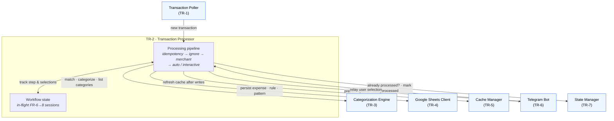

# TR-2. Transaction Processor

> Status: **Automatic path implemented** (FR-1/4/5), unit-tested. The interactive
> unknown-merchant workflow (FR-6→8) is a later slice — unknown transactions are
> currently delegated to a placeholder handler.

## Traceability
- Functional requirements: FR-1, FR-4, FR-5, FR-6 (orchestration of the processing flow)
- Non-functional requirements: —
- Architecture: [Transaction Processor](../architecture.md) (§2)

## Purpose & Scope
Orchestrates the end-to-end processing of a single transaction: idempotency check →
ignore-pattern check → merchant-rule match → automatic categorization or Telegram
workflow. Owns the write/mark-processed ordering that guarantees idempotency.

## System Decomposition
The Processor is the system's **sole orchestrator**. It has two internal parts — the
per-transaction **processing pipeline** and the **workflow state** it holds for the
interactive FR-6→8 flow — and it reaches every other component. Notably it touches
**no external system directly**: all Enable Banking / Google Sheets / Telegram access
is delegated to the respective components.

**Legend:** boxes inside the *TR-2* frame are the Processor's internal parts; **blue**
nodes are other components (their own TRs). Solid arrows are conceptual interactions.
There is no external (purple) node here by design — the Processor delegates all
external access. The round trip to the Bot (present options → relay selection) plus the
`Workflow state` is what drives the multi-step interactive flow.

## Responsibilities
- Skip already-processed transactions (TR-7).
- Evaluate ignore patterns before merchant rules (FR-4 ordering).
- On ignore match: mark processed, no notification, no write (FR-4).
- On merchant match: assign categories, persist expense, notify, mark processed (FR-5).
- On no match: drive the interactive unknown-merchant workflow (FR-6→8) — **as the sole orchestrator**, the Processor:
  - queries the Categorization Engine (TR-3) for the data to present (Primary Categories, then Secondary Categories for the chosen Primary, then merchant-substring / ignore-pattern candidates);
  - sends each option set to the Telegram Bot (TR-6) and receives the user's raw selection back;
  - on completion, persists the rule/pattern and expense via the Sheets Client (TR-4), triggers a cache refresh (TR-5), and marks processed (TR-7).
- Own the multi-step **workflow state** (which transaction, current step, partial selections); the Bot holds only callback-routing (see TR-6).

## Design Decisions
- **Ordering (decided, DD-3):** for a merchant match → **write expense (TR-4) →
  `mark_processed` (TR-7) → notify (FR-5)**. Mark immediately after the write minimizes
  the duplicate window; a crash between write and mark re-processes next cycle (accepted
  at-least-once). For an ignore match → `mark_processed` only (no write, no notify, FR-4).
- **Notification (decided):** FR-5 notification is **best-effort** — sent *after* mark,
  and a failure is logged and swallowed (an informational message must never block the
  flow or cause reprocessing).
- **Unknown handling (this slice):** delegated to an `UnknownTransactionHandler` port;
  the placeholder logs and does **not** mark processed (revisited when FR-6→8 lands), and
  does not notify (avoids re-spamming each poll). The real interactive workflow replaces it.
- **Decoupling:** the Processor depends only on Protocols (`Engine`, `ExpenseWriter`,
  `ProcessedState`, `Notifier`, `UnknownTransactionHandler`) satisfied by TR-3/4/7/6.

## Data Model / Contracts
Implements the poller's `TransactionSink` — `async handle(transaction: Transaction)`.
Consumes the internal `Transaction` (TR-1); on a match produces an `ExpenseRow` (TR-4)
and a formatted FR-5 notification string. Ports are defined in
`expenses/processor/ports.py`.

## Interfaces
- Inbound: `Transaction` from Poller (TR-1); user selections relayed by the Bot (TR-6).
- Outbound: Categorization Engine (TR-3) — matching, candidates, **and category listing (FR-7)**; Sheets Client (TR-4) — persist expense/rule/pattern; Cache Manager (TR-5) — refresh after writes; Telegram Bot (TR-6) — present options / collect answers; State Manager (TR-7) — processed check + mark.

## Dependencies
- TR-3, TR-4, TR-5, TR-6, TR-7.

## Risks & Assumptions
- Non-atomic Sheets writes + local state file mean the failure window must be explicitly defined and tolerated.
- Assumes a notification failure (FR-5) should not block marking processed — needs confirmation.

## Open Questions
- ✅ Expense write succeeds but mark fails → transaction is reprocessed next cycle (at-least-once, DD-3); a duplicate row is the accepted, easily-corrected outcome.
- ✅ Notification failures → logged and ignored (best-effort).

## Implementation (automatic path)
Package [`src/expenses/processor/`](../../src/expenses/processor/):
- [`processor.py`](../../src/expenses/processor/processor.py) — `TransactionProcessor.handle()`: processed-check → ignore → merchant → auto-categorize / delegate; `format_categorized()` (FR-5 text).
- [`ports.py`](../../src/expenses/processor/ports.py) — the five Protocols + `LoggingNotifier` / `LoggingUnknownHandler` defaults.
- [`notifier.py`](../../src/expenses/processor/notifier.py) — `TelegramNotifier` adapter (bot → Notifier port).

Tests in [`tests/test_processor.py`](../../tests/test_processor.py) cover all four
branches (already-processed, ignore, merchant match, unknown), the write→mark ordering,
and best-effort notification. **Not yet implemented:** the FR-6→8 interactive workflow
and its Processor-owned conversation state.
