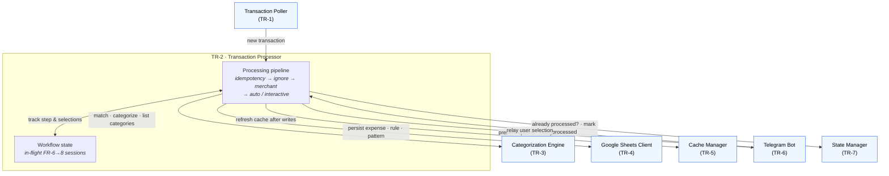

# TR-2. Transaction Processor

> Status: Draft skeleton.

## Traceability
- Functional requirements: FR-1, FR-4, FR-5, FR-6 (orchestration of the processing flow)
- Non-functional requirements: —
- Architecture: [Transaction Processor](../architecture.md) (§2)

## Purpose & Scope
Orchestrates the end-to-end processing of a single transaction: idempotency check →
ignore-pattern check → merchant-rule match → automatic categorization or Telegram
workflow. Owns the write/mark-processed ordering that guarantees idempotency.

## System Decomposition
The Processor is the system's **sole orchestrator**. It has two internal parts — the
per-transaction **processing pipeline** and the **workflow state** it holds for the
interactive FR-6→8 flow — and it reaches every other component. Notably it touches
**no external system directly**: all Enable Banking / Google Sheets / Telegram access
is delegated to the respective components.

**Legend:** boxes inside the *TR-2* frame are the Processor's internal parts; **blue**
nodes are other components (their own TRs). Solid arrows are conceptual interactions.
There is no external (purple) node here by design — the Processor delegates all
external access. The round trip to the Bot (present options → relay selection) plus the
`Workflow state` is what drives the multi-step interactive flow.

## Responsibilities
- Skip already-processed transactions (TR-7).
- Evaluate ignore patterns before merchant rules (FR-4 ordering).
- On ignore match: mark processed, no notification, no write (FR-4).
- On merchant match: assign categories, persist expense, notify, mark processed (FR-5).
- On no match: drive the interactive unknown-merchant workflow (FR-6→8) — **as the sole orchestrator**, the Processor:
  - queries the Categorization Engine (TR-3) for the data to present (Primary Categories, then Secondary Categories for the chosen Primary, then merchant-substring / ignore-pattern candidates);
  - sends each option set to the Telegram Bot (TR-6) and receives the user's raw selection back;
  - on completion, persists the rule/pattern and expense via the Sheets Client (TR-4), triggers a cache refresh (TR-5), and marks processed (TR-7).
- Own the multi-step **workflow state** (which transaction, current step, partial selections); the Bot holds only callback-routing (see TR-6).

## Design Decisions
_TBD._ Candidate topics:
- **Ordering contract:** write expense (TR-4) *then* persist processed id (TR-7); define behavior on partial failure (crash-consistency for FR-13).
- Error handling / retry policy for transient Sheets or Telegram failures.
- Concurrency: can multiple transactions be in flight at once, and does that interact with conversation state (TR-6)?

## Data Model / Contracts
_TBD._ Consumes internal `Transaction` (TR-1); produces expense-write requests (TR-4) and notification requests (TR-6).

## Interfaces
- Inbound: `Transaction` from Poller (TR-1); user selections relayed by the Bot (TR-6).
- Outbound: Categorization Engine (TR-3) — matching, candidates, **and category listing (FR-7)**; Sheets Client (TR-4) — persist expense/rule/pattern; Cache Manager (TR-5) — refresh after writes; Telegram Bot (TR-6) — present options / collect answers; State Manager (TR-7) — processed check + mark.

## Dependencies
- TR-3, TR-4, TR-5, TR-6, TR-7.

## Risks & Assumptions
- Non-atomic Sheets writes + local state file mean the failure window must be explicitly defined and tolerated.
- Assumes a notification failure (FR-5) should not block marking processed — needs confirmation.

## Open Questions
- If the expense write succeeds but marking processed fails, what is the recovery expectation?
- Should automatic-categorization notification failures be retried, logged, or ignored?
