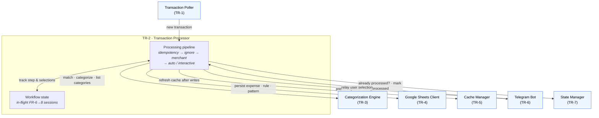

# TR-2. Transaction Processor

> Status: **Implemented** (automatic FR-1/4/5 **and** interactive FR-6→8 paths),
> unit-tested. The automatic path lives in `processor.py`; the interactive
> unknown-merchant workflow lives in `conversation.py` (the Processor's conversation
> orchestrator), which owns all workflow state.

## Traceability
- Functional requirements: FR-1, FR-4, FR-5, FR-6 (orchestration of the processing flow)
- Non-functional requirements: —
- Architecture: [Transaction Processor](../architecture.md) (§2)

## Purpose & Scope
Orchestrates the end-to-end processing of a single transaction: idempotency check →
ignore-pattern check → merchant-rule match → automatic categorization or Telegram
workflow. Owns the write/mark-processed ordering that guarantees idempotency.

## System Decomposition
The Processor is the system's **sole orchestrator**. It has two internal parts — the
per-transaction **processing pipeline** and the **workflow state** it holds for the
interactive FR-6→8 flow — and it reaches every other component. Notably it touches
**no external system directly**: all Enable Banking / Google Sheets / Telegram access
is delegated to the respective components.

**Legend:** boxes inside the *TR-2* frame are the Processor's internal parts; **blue**
nodes are other components (their own TRs). Solid arrows are conceptual interactions.
There is no external (purple) node here by design — the Processor delegates all
external access. The round trip to the Bot (present options → relay selection) plus the
`Workflow state` is what drives the multi-step interactive flow.

## Responsibilities
- Skip already-processed transactions (TR-7).
- Evaluate ignore patterns before merchant rules (FR-4 ordering).
- On ignore match: mark processed, no notification, no write (FR-4).
- On merchant match: assign categories, persist expense, notify, mark processed (FR-5).
- On no match: drive the interactive unknown-merchant workflow (FR-6→8) — **as the sole orchestrator**, the Processor:
  - queries the Categorization Engine (TR-3) for the data to present (Primary Categories, then Secondary Categories for the chosen Primary, then merchant-substring / ignore-pattern candidates);
  - sends each option set to the Telegram Bot (TR-6) and receives the user's raw selection back;
  - on completion, persists the rule/pattern and expense via the Sheets Client (TR-4), triggers a cache refresh (TR-5), and marks processed (TR-7).
- Own the multi-step **workflow state** (which transaction, current step, partial selections); the Bot holds only callback-routing (see TR-6).

## Design Decisions
- **Ordering (decided, DD-3):** for a merchant match → **write expense (TR-4) →
  `mark_processed` (TR-7) → notify (FR-5)**. Mark immediately after the write minimizes
  the duplicate window; a crash between write and mark re-processes next cycle (accepted
  at-least-once). For an ignore match → `mark_processed` only (no write, no notify, FR-4).
- **Notification (decided):** FR-5 notification is **best-effort** — sent *after* mark,
  and a failure is logged and swallowed (an informational message must never block the
  flow or cause reprocessing).
- **Unknown handling (implemented):** delegated to an `UnknownTransactionHandler` port,
  now satisfied by the **conversation orchestrator** (`conversation.py`). A logging
  placeholder remains the fallback when Telegram is unconfigured.
- **Interactive concurrency (decided, DD-5):** at most **one conversation is active**
  at a time (single-user design); further unknown transactions **queue (FIFO)** and are
  drained when the active one finishes. Draining re-runs each queued transaction through
  the **full pipeline**, so a merchant rule just added for one transaction
  auto-categorizes its siblings in the same batch. All workflow-state mutation is
  serialized by an `asyncio.Lock`, released before re-processing (which re-enters the
  handler) so there is no re-entrancy deadlock. In-flight transaction ids are de-duped so
  a later poll cycle cannot double-queue or re-notify a pending one. **The drain fires
  whenever the active session *ended* (`self._active is None` after handling a callback),
  not on a step's return flag** — a session can complete indirectly (an empty-candidate
  step or an abort finishes it from inside a helper), and keying off the return flag once
  left those queued transactions stranded until an app restart.
- **Callback keying (decided, DD-6):** each prompt's inline buttons carry
  `f"{step}:{index}"` — a **step tag** plus the **option index**, never the option text.
  Indices keep callback_data within Telegram's 64-byte limit regardless of category-name
  length, and the step tag lets the orchestrator reject stale taps on superseded prompts
  (a tap is accepted only when its tag equals the active session's current step).
- **Merchant rule as additive multi-select (decided, DD-7):** the merchant step (FR-7.3/4)
  is not a single tap — tapping a word **toggles** it into the rule and the prompt is
  re-rendered in place (checkmarks + a running preview); a `f"{step}:done"` button (shown
  once ≥1 word is picked) finalizes. One word → a single-word rule; several → an
  **AND-combination** stored joined by `+` (TR-3). Toggles keep the option order/indices
  stable across re-renders, so a delayed tap can never map to the wrong word. This is why
  the Bot presenter also exposes `edit_options` (in-place re-render).
- **Rule/pattern creation is optional — Skip (decided, DD-8):** both the merchant step and
  the ignore step always offer a `f"{step}:skip"` button (independent of any selection).
  Merchant Skip categorizes *this* transaction with the chosen Primary/Secondary but writes
  **no** merchant rule; ignore Skip marks *this* transaction ignored (no expense) but adds
  **no** ignore pattern. Both skip the cache refresh — for a one-off the user doesn't want
  to generalize. Each is the same terminal as its empty-candidate fallback
  (`substring=None` / `pattern=None`), just user-initiated.
- **Empty-candidate fallbacks (decided):** if no merchant substrings can be suggested
  (FR-9), the expense is still recorded with the chosen category (the user's work isn't
  lost) but **no rule** is created; if no ignore patterns can be suggested (FR-10), the
  transaction is still marked processed (FR-8's core effect) with **no pattern** added.
  A missing Primary/Secondary list is a Support-sheet misconfiguration → the session
  aborts *without* marking processed, so it is retried once the sheet is fixed.
- **Decoupling:** both paths depend only on Protocols — the automatic path on `Engine`,
  `ExpenseWriter`, `ProcessedState`, `Notifier`, `UnknownTransactionHandler`; the
  conversation on `ConversationEngine`, `RuleWriter`, `RefreshableCache`, `ProcessedState`,
  `Presenter` — all satisfied by TR-3/4/5/6/7. The composition root (TR-0) breaks the
  bot ⇄ orchestrator and processor ⇄ orchestrator cycles via `bind()` / `set_reprocess()`.

## Data Model / Contracts
Implements the poller's `TransactionSink` — `async handle(transaction: Transaction)`.
Consumes the internal `Transaction` (TR-1); on a match produces an `ExpenseRow` (TR-4)
and a formatted FR-5 notification string. Ports are defined in
`expenses/processor/ports.py`.

## Interfaces
- Inbound: `Transaction` from Poller (TR-1); user selections relayed by the Bot (TR-6).
- Outbound: Categorization Engine (TR-3) — matching, candidates, **and category listing (FR-7)**; Sheets Client (TR-4) — persist expense/rule/pattern; Cache Manager (TR-5) — refresh after writes; Telegram Bot (TR-6) — present options / collect answers; State Manager (TR-7) — processed check + mark.

## Dependencies
- TR-3, TR-4, TR-5, TR-6, TR-7.

## Risks & Assumptions
- Non-atomic Sheets writes + local state file mean the failure window must be explicitly defined and tolerated.
- Assumes a notification failure (FR-5) should not block marking processed — needs confirmation.

## Open Questions
- ✅ Expense write succeeds but mark fails → transaction is reprocessed next cycle (at-least-once, DD-3); a duplicate row is the accepted, easily-corrected outcome.
- ✅ Notification failures → logged and ignored (best-effort).

## Implementation (automatic path)
Package [`src/expenses/processor/`](../../src/expenses/processor/):
- [`processor.py`](../../src/expenses/processor/processor.py) — `TransactionProcessor.handle()`: processed-check → ignore → merchant → auto-categorize / delegate; `format_categorized()` (FR-5 text).
- [`ports.py`](../../src/expenses/processor/ports.py) — the five Protocols + `LoggingNotifier` / `LoggingUnknownHandler` defaults.
- [`notifier.py`](../../src/expenses/processor/notifier.py) — `TelegramNotifier` adapter (bot → Notifier port).

Tests in [`tests/test_processor.py`](../../tests/test_processor.py) cover all four
branches (already-processed, ignore, merchant match, unknown), the write→mark ordering,
and best-effort notification.

## Implementation (interactive path)
[`conversation.py`](../../src/expenses/processor/conversation.py) —
`ConversationOrchestrator` is both the `UnknownTransactionHandler` (the automatic path
delegates unknowns to it) and the `TelegramUpdateHandler` (the Bot routes taps to it).
It owns the `Session` workflow state (transaction, `Step`, partial selections), the
one-active-plus-FIFO-queue discipline, the step machine
(`ACTION→PRIMARY→SECONDARY→MERCHANT` for FR-7, `ACTION→IGNORE` for FR-8), and every
terminal write (Support/Ignore update → cache refresh → expense write → mark processed).
The five Protocols it needs (`ConversationEngine`, `RuleWriter`, `RefreshableCache`,
`Presenter`, and `ProcessedState`) are defined alongside it / in `ports.py`.

Tests in [`tests/test_conversation.py`](../../tests/test_conversation.py) cover the
categorize and ignore happy paths, stale/out-of-range/malformed and no-session
callbacks, the empty-candidate fallbacks, the abort-on-misconfig path, and the
queue/drain behaviour (queue-then-begin-next, dedup, drain-until-empty).
