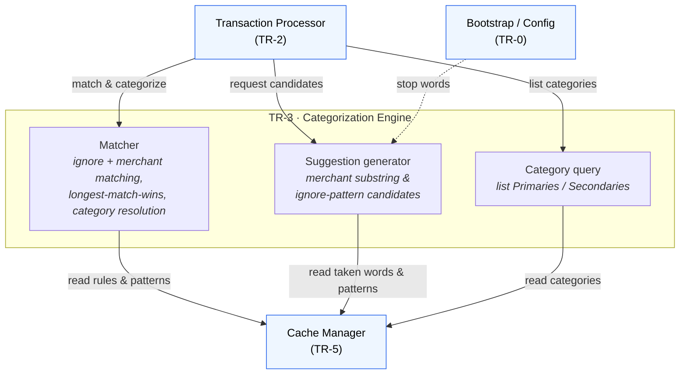

# TR-3. Categorization Engine

> Status: Specified & **implemented** (unit-tested; pure logic, no I/O).

## Traceability
- Functional requirements: FR-3 (merchant matching), FR-4 (ignore matching), FR-5 (assignment), FR-9 (substring suggestion), FR-10 (ignore-pattern suggestion)
- Non-functional requirements: NFR-5 (serve lookups from cache)
- Architecture: [Categorization Engine](../architecture.md) (§3)

## Purpose & Scope
Pure business logic for matching and suggestion. Independent of Telegram and Google
Sheets — operates only on the internal `Transaction` and the in-memory cache (TR-5).

## System Decomposition
Three internal concerns, all reading the cache only: the **Matcher** (FR-3/4/5), the
**Suggestion generator** (FR-9/10), and the **Category query** surface (FR-7). The
Engine is called only by the Processor and touches no external system.

**Legend:** boxes inside the *TR-3* frame are the Engine's internal parts; **blue**
nodes are other components. Solid arrows are conceptual interactions; the dashed arrow
is config wiring (stop words, TR-0). There is no external node — the Engine reads the
**Cache only**, never Google Sheets, Telegram or Enable Banking, and is called **only by
the Processor**.

## Responsibilities
- Match description against ignore patterns (case-insensitive, trimmed, substring — FR-4).
- Match description against merchant rules; longest matching substring wins (FR-3).
- Resolve Primary + Secondary category for a matched rule (FR-5).
- Generate merchant-substring candidates from a description (FR-9): split on spaces, uppercase, trim, exclude existing rule words and stop words.
- Generate ignore-pattern candidates using the same algorithm, excluding existing ignore patterns and stop words (FR-10).
- **Own the category query surface** — expose read operations over the categorical
  data for presentation (FR-7): list Primary Categories, list Secondary Categories for
  a given Primary. The Engine is the single semantic layer over the cache; callers
  (the Processor) never read the cache's category structure directly. Resolves the
  ownership boundary flagged in [TR-5](TR-5-cache-manager.md).

## Design Decisions
- **FR-3 tie-break (decided):** longest matching substring wins; equal-length ties
  resolved by **sheet order** (first-defined), by scanning entries in order and only
  replacing on a strictly-longer match.
- **Candidate tokenization (decided):** split on whitespace, strip surrounding
  punctuation, uppercase; then drop tokens <2 chars and tokens containing **any digit**
  (dates, amounts, IBANs, card refs, transaction codes). Dedupe, preserve order.
- **Stop words (decided):** a **config list** (`stopwords.py`, `DEFAULT_STOP_WORDS`),
  injected into the Engine as a `set[str]`; edit-in-place, migratable to a Sheet later
  with no Engine change. Tuned to Italian bank phrasing.
- **FR-9 exclusion scope (decided): global** — a candidate is excluded if it's already
  a merchant substring in **any** rule (not just other categories).
- **Lookup structures (decided):** the Engine iterates the cache snapshot directly
  (≈34 rules) — no pre-built index. In-memory, so NFR-5 (no API calls) holds.

## Data Model / Contracts
Stateless; reads the current `CacheSnapshot` (TR-5) on each call. API:
- `match_merchant(description) -> MatchResult | None` — `MatchResult(primary, secondary, substring)` (FR-3/5).
- `find_ignore_match(description) -> str | None` — the matched pattern (FR-4).
- `list_primaries() -> list[str]`, `list_secondaries(primary) -> list[str]` (FR-7).
- `suggest_merchant_substrings(description) -> list[str]` (FR-9).
- `suggest_ignore_patterns(description) -> list[str]` (FR-10).
Constructed with a `CacheView` Protocol (the Cache Manager) + `stop_words`.

## Interfaces
- Inbound: called by the Transaction Processor (TR-2) — for matching/assignment (FR-3/4/5), candidate generation (FR-9/10), and category listing (FR-7). The Telegram Bot (TR-6) does **not** call the Engine directly (the Processor orchestrates).
- Outbound: reads cache (TR-5) only; performs no writes.

## Dependencies
- TR-5 (cache), TR-0 (stop words configuration).

## Risks & Assumptions
- Whitespace tokenization + digit/stop-word filtering handles the real Italian
  descriptions well (validated against sample rows); the stop-word list will need
  occasional tuning as new noise words appear.
- Substring *containment* matching (FR-3) can over-match (e.g. a rule `very` matches
  `delivery`); this is per-spec and mitigated by preferring longer substrings.

## Open Questions (resolved)
- ✅ Equal-length tie-break → sheet order.
- ✅ FR-9 exclusion scope → global.

## Implementation
Package [`src/expenses/categorization/`](../../src/expenses/categorization/):
- [`engine.py`](../../src/expenses/categorization/engine.py) — `CategorizationEngine` + `CacheView` Protocol.
- [`models.py`](../../src/expenses/categorization/models.py) — `MatchResult`.
- [`tokens.py`](../../src/expenses/categorization/tokens.py) — candidate tokenization.
- [`stopwords.py`](../../src/expenses/categorization/stopwords.py) — `DEFAULT_STOP_WORDS` (the config list).

Tests: [`test_engine_matching.py`](../../tests/test_engine_matching.py),
[`test_engine_suggestions.py`](../../tests/test_engine_suggestions.py),
[`test_tokens.py`](../../tests/test_tokens.py) — cover longest-match/tie-break,
ignore matching, category listing, and suggestion filtering against real sample rows.
