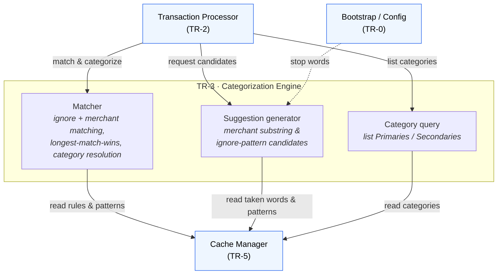

# TR-3. Categorization Engine

> Status: Draft skeleton.

## Traceability
- Functional requirements: FR-3 (merchant matching), FR-4 (ignore matching), FR-5 (assignment), FR-9 (substring suggestion), FR-10 (ignore-pattern suggestion)
- Non-functional requirements: NFR-5 (serve lookups from cache)
- Architecture: [Categorization Engine](../architecture.md) (§3)

## Purpose & Scope
Pure business logic for matching and suggestion. Independent of Telegram and Google
Sheets — operates only on the internal `Transaction` and the in-memory cache (TR-5).

## System Decomposition
Three internal concerns, all reading the cache only: the **Matcher** (FR-3/4/5), the
**Suggestion generator** (FR-9/10), and the **Category query** surface (FR-7). The
Engine is called only by the Processor and touches no external system.

**Legend:** boxes inside the *TR-3* frame are the Engine's internal parts; **blue**
nodes are other components. Solid arrows are conceptual interactions; the dashed arrow
is config wiring (stop words, TR-0). There is no external node — the Engine reads the
**Cache only**, never Google Sheets, Telegram or Enable Banking, and is called **only by
the Processor**.

## Responsibilities
- Match description against ignore patterns (case-insensitive, trimmed, substring — FR-4).
- Match description against merchant rules; longest matching substring wins (FR-3).
- Resolve Primary + Secondary category for a matched rule (FR-5).
- Generate merchant-substring candidates from a description (FR-9): split on spaces, uppercase, trim, exclude existing rule words and stop words.
- Generate ignore-pattern candidates using the same algorithm, excluding existing ignore patterns and stop words (FR-10).
- **Own the category query surface** — expose read operations over the categorical
  data for presentation (FR-7): list Primary Categories, list Secondary Categories for
  a given Primary. The Engine is the single semantic layer over the cache; callers
  (the Processor) never read the cache's category structure directly. Resolves the
  ownership boundary flagged in [TR-5](TR-5-cache-manager.md).

## Design Decisions
_TBD._ Candidate topics:
- Tie-breaking when two matched substrings have equal length (FR-3 undefined).
- Candidate ordering/dedup rules presented to the user (FR-9/10).
- Where the matching structures live (this engine vs. TR-5) and the lookup complexity target (NFR-5).

## Data Model / Contracts
_TBD._ Consumes cache snapshots (TR-5); returns match results (category pair) and candidate lists (`list[str]`). Stateless — no I/O.

## Interfaces
- Inbound: called by the Transaction Processor (TR-2) — for matching/assignment (FR-3/4/5), candidate generation (FR-9/10), and category listing (FR-7). The Telegram Bot (TR-6) does **not** call the Engine directly (the Processor orchestrates).
- Outbound: reads cache (TR-5) only; performs no writes.

## Dependencies
- TR-5 (cache), TR-0 (stop words configuration).

## Risks & Assumptions
- Assumes description tokenization on single spaces is sufficient (FR-9 example implies this).
- "Words already used by another merchant rule" (FR-9) scope must be defined: all rules, or same category?

## Open Questions
- Equal-length match tie-break rule?
- Does substring exclusion in FR-9 consider every merchant rule globally or only other categories?
