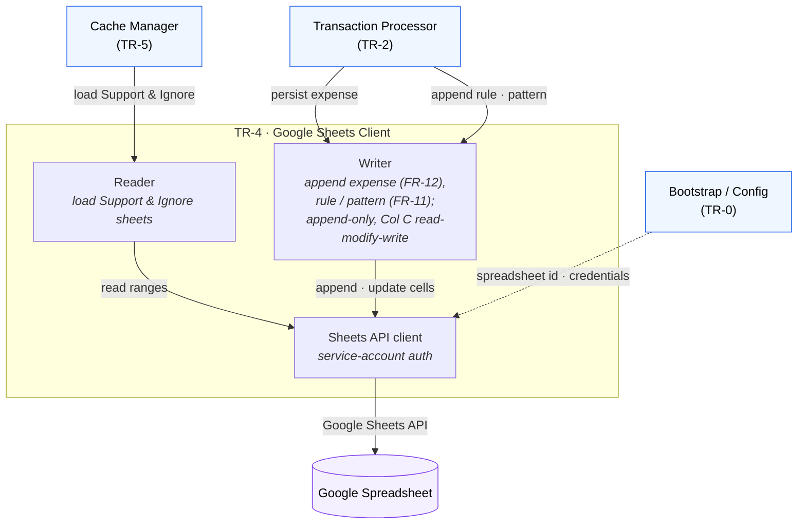

# TR-4. Google Sheets Client

> Status: Draft skeleton.

## Traceability
- Functional requirements: FR-2 (load config), FR-11 (merchant rule persistence), FR-12 (expense persistence)
- Non-functional requirements: NFR-2 (Sheets is only repository), NFR-4 (authoritative source of truth)
- Architecture: [Google Sheets Client](../architecture.md) (§4); layout in [spreadsheet-structure.md](../spreadsheet-structure.md)

## Purpose & Scope
The sole component that talks to Google Sheets. Encapsulates the fixed spreadsheet
layout (Support A/B/C, Ignore patterns, monthly Jan–Dec sheets) behind a typed API so
no other component depends on cell coordinates.

## System Decomposition
The **only** component that touches Google Sheets. Internally: a **Reader** (loads the
Support & Ignore sheets for the cache), a **Writer** (append-only persistence, except
the Support Column C read-modify-write for FR-11), and an authenticated **Sheets API
client**. Its callers are the Cache Manager (reads) and the Processor (writes).

**Legend:** boxes inside the *TR-4* frame are the client's internal parts; **blue**
nodes are other components; the **purple** node is the external Google Spreadsheet.
Solid arrows are conceptual interactions; the dashed arrow is config wiring. All
spreadsheet access funnels through this component — no one else depends on cell
coordinates.

## Responsibilities
- Read the Support sheet (Primary A, Secondary B, Merchant Substrings C) and Ignore patterns sheet (FR-2).
- Append a merchant substring to the correct Support row (Primary+Secondary), preserving the comma-separated list and rejecting duplicates (FR-11).
- Append an expense row to the month sheet derived from the booking date (FR-12).
- Never mutate the Support layout beyond Column C (architecture append-only principle).

## Design Decisions
_TBD._ Candidate topics:
- Client library and auth (service account) for Google Sheets.
- Read strategy (batch ranges) to minimise API calls (NFR-5) and locate the target row for FR-11.
- Column C update semantics: read-modify-write of the comma-separated list; whitespace/casing normalization for duplicate detection.
- Month-name → sheet mapping (Jan…Dec) from booking date.

## Data Model / Contracts
_TBD._ Return shapes for Support/Ignore reads (feed TR-5 cache); write requests for merchant substring (FR-11) and expense row (FR-12, columns A–E per spreadsheet-structure).

## Interfaces
- Inbound: Cache Manager (TR-5) for reads; Transaction Processor (TR-2) / Telegram workflow (TR-6) for writes.
- Outbound: Google Sheets API.

## Dependencies
- TR-0 (spreadsheet id, credentials).

## Risks & Assumptions
- Assumes the fixed layout in spreadsheet-structure.md and that the app must not alter it.
- Concurrent writes vs. read-modify-write on Column C could race (single-user mitigates but should be stated).
- Sheet name is the abbreviated English month regardless of locale.

## Open Questions
- Duplicate detection for FR-11: case- and whitespace-insensitive comparison?
- Behavior if the target month sheet does not exist.
