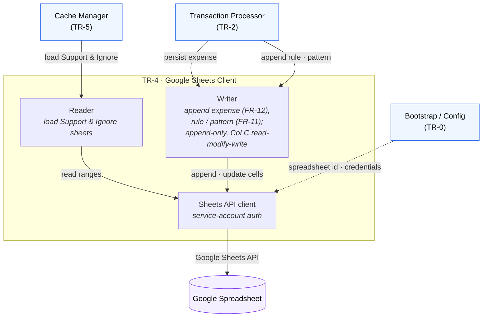

# TR-4. Google Sheets Client

> Status: Specified, **implemented, and fully live-validated (read + write)** against
> the real spreadsheet. Read: `uv run expenses-sheets check` (Support: 158 rows / 16
> primary categories parsed correctly). Write (FR-12): `uv run expenses-sheets
> write-test` appended a row to the `Jul` sheet with the correct numeric amount and ISO
> date. FR-11 (merchant substring append) is unit-tested; not yet exercised live to
> avoid mutating the Support config sheet.

## Traceability
- Functional requirements: FR-2 (load config), FR-11 (merchant rule persistence), FR-12 (expense persistence)
- Non-functional requirements: NFR-2 (Sheets is only repository), NFR-4 (authoritative source of truth)
- Architecture: [Google Sheets Client](../architecture.md) (§4); layout in [spreadsheet-structure.md](../spreadsheet-structure.md)

## Purpose & Scope
The sole component that talks to Google Sheets. Encapsulates the fixed spreadsheet
layout (Support A/B/C, Ignore patterns, monthly Jan–Dec sheets) behind a typed API so
no other component depends on cell coordinates.

## System Decomposition
The **only** component that touches Google Sheets. Internally: a **Reader** (loads the
Support & Ignore sheets for the cache), a **Writer** (append-only persistence, except
the Support Column C read-modify-write for FR-11), and an authenticated **Sheets API
client**. Its callers are the Cache Manager (reads) and the Processor (writes).

**Legend:** boxes inside the *TR-4* frame are the client's internal parts; **blue**
nodes are other components; the **purple** node is the external Google Spreadsheet.
Solid arrows are conceptual interactions; the dashed arrow is config wiring. All
spreadsheet access funnels through this component — no one else depends on cell
coordinates.

## Responsibilities
- Read the Support sheet (Primary A, Secondary B, Merchant Substrings C) and Ignore patterns sheet (FR-2).
- Append a merchant substring to the correct Support row (Primary+Secondary), preserving the comma-separated list and rejecting duplicates (FR-11).
- Append an expense row to the month sheet derived from the booking date (FR-12).
- Never mutate the Support layout beyond Column C (architecture append-only principle).

## Design Decisions
- **Library & auth (decided):** official `google-api-python-client` + `google-auth`
  with a **service account** (JSON key). The sync client is bridged to the async app
  via `asyncio.to_thread` in the `GoogleSheetsClient` facade. The spreadsheet must be
  **shared with the service-account `client_email`** (Editor) — a project IAM role is
  not enough.
- **Value formatting (decided, from the real sheet):** writes use `USER_ENTERED`;
  **amount is sent as a numeric value** (locale-proof — a number is stored as a number,
  displayed per the sheet's format) and **date as ISO `YYYY-MM-DD`** (the sheet's Date
  column is ISO). Amounts are positive.
- **FR-11 Column C (decided):** read `Support!A:C`, locate the `(Primary, Secondary)`
  row (exact, trimmed), read-modify-write only that `C` cell. New substrings stored
  **lowercase**; list joined with `", "`; duplicates rejected **case-insensitively**.
- **Month mapping (decided):** hard-coded English `Jan…Dec` (not locale-dependent
  `calendar`); missing month sheet → **fail loudly** (`SheetNotFoundError`).
- **Read strategy:** Support (`A:C`) and Ignore (`A:A`) read directly. **Neither sheet
  has a header row — every row is data** (so `"Revolut"` in the Ignore sheet is a real
  pattern). No header-skipping logic.

## Data Model / Contracts
- **Read (feeds TR-5):** `SupportRow(primary, secondary, substrings: list[str])` and
  `list[str]` ignore patterns.
- **Write (from TR-2):** `ExpenseRow(name, date, amount: Decimal, primary, secondary)`
  → month sheet columns A–E (FR-12); `add_merchant_substring(primary, secondary,
  substring)` (FR-11); and `add_ignore_pattern(pattern)` → append to the Ignore sheet
  (FR-8.4), stored lowercase, case-insensitive dedupe (mirrors FR-11).

## Interfaces
- Inbound: Cache Manager (TR-5) for reads; Transaction Processor (TR-2) for writes.
  (The Telegram Bot never calls this — the Processor orchestrates, per architecture.md.)
- Outbound: Google Sheets API.

## Dependencies
- TR-0 (spreadsheet id, credentials).

## Risks & Assumptions
- **Service-account sharing:** the spreadsheet must be shared with the SA `client_email`; the project IAM Editor role does **not** grant document access (403 otherwise).
- Assumes the fixed layout in spreadsheet-structure.md and that the app must not alter it.
- **No header rows** on Support or Ignore (confirmed by the user); every row is data.
- Concurrent writes vs. read-modify-write on Column C could race (single-user mitigates but stated).
- `float(Decimal)` is used to send the amount as a JSON number; fine for 2-decimal currency display, but note it is not exact arithmetic (the Sheet stores the display value, not a running balance).

## Open Questions (resolved)
- ✅ **Duplicate detection (FR-11):** case-insensitive + trimmed.
- ✅ **Missing month sheet (FR-12):** fail loudly (`SheetNotFoundError`).
- ✅ **Amount/date/locale:** the real sheet uses ISO dates and dot-decimal amounts; amount written numeric, date written ISO (see Design Decisions).

## Implementation
Package [`src/expenses/sheets/`](../../src/expenses/sheets/):
- [`client.py`](../../src/expenses/sheets/client.py) — service-account auth + async `GoogleSheetsClient` facade (`asyncio.to_thread`).
- [`reader.py`](../../src/expenses/sheets/reader.py) — Support + Ignore reads.
- [`writer.py`](../../src/expenses/sheets/writer.py) — expense append (FR-12), Column C read-modify-write (FR-11), Ignore-sheet append (FR-8.4).
- [`months.py`](../../src/expenses/sheets/months.py) · [`models.py`](../../src/expenses/sheets/models.py) · [`errors.py`](../../src/expenses/sheets/errors.py).
- [`sheets_cli.py`](../../src/expenses/sheets_cli.py) — `expenses-sheets check`, read-only setup validation.

Tests in [`tests/`](../../tests/) cover reader parsing (header/blank handling), expense
append (numeric amount, ISO date, missing-sheet failure), FR-11 append + case-insensitive
dedupe + unknown-category error, and month mapping.
