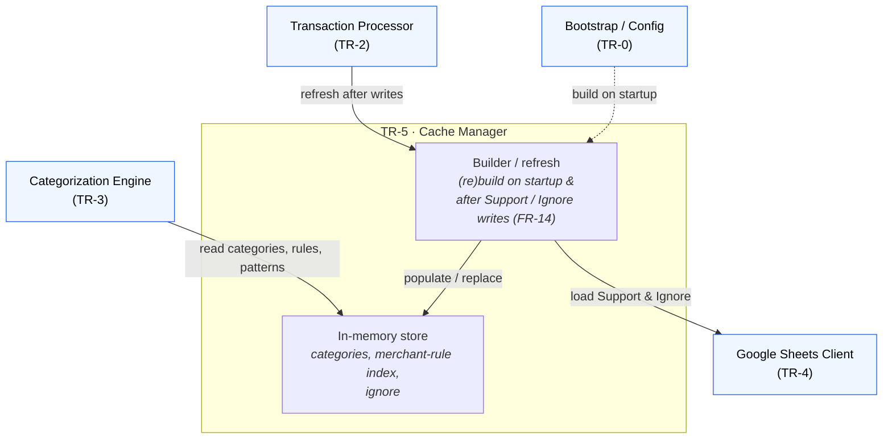

# TR-5. Cache Manager

> Status: Specified & **implemented** (unit-tested). Data path (TR-4 reads) already
> live-validated.

## Traceability
- Functional requirements: FR-2 (load into memory), FR-14 (cache refresh)
- Non-functional requirements: NFR-4 (cache is not source of truth), NFR-5 (minimise API calls)
- Architecture: [Cache Manager](../architecture.md) (§5)

## Purpose & Scope
Maintains the in-memory representation of spreadsheet data (Primary Categories,
Secondary Categories, Merchant Rules, Ignore Patterns) and exposes it to the
Categorization Engine. Rebuilt from Sheets; never persisted.

## System Decomposition
A **dumb store** (semantics live in the Engine, TR-3). Internally: the **in-memory
store** of cached structures, and a **builder/refresh** that (re)loads it from the
Sheets Client on startup and after every Support/Ignore write (FR-14). The Cache
reaches Google Sheets only *through* the Sheets Client — never directly.

**Legend:** boxes inside the *TR-5* frame are the Cache's internal parts; **blue** nodes
are other components. Solid arrows are conceptual interactions; the dashed arrow is
startup wiring. No external node — the Cache reads Google Sheets only via the Sheets
Client. The **read-after-write loop**: after the Processor writes a rule/pattern (via
TR-4), it triggers a refresh here, the builder reloads through TR-4, and the Engine then
reads the updated store.

## Responsibilities
- Build the cache from the Sheets Client on startup (FR-2, FR-14).
- Rebuild after every successful Support-sheet update and Ignore-patterns update (FR-14).
- Serve category/rule/pattern lookups to the Categorization Engine (NFR-5).

## Design Decisions
- **Full rebuild (decided):** every `refresh()` reloads the whole Support + Ignore data
  from TR-4 (two reads) and rebuilds the snapshot. No incremental updates — the data is
  tiny (≈158 rows) so the complexity isn't warranted.
- **Immutable snapshot + atomic swap (decided):** the cache holds a frozen
  `CacheSnapshot`; `refresh()` builds a new one and swaps the reference in a single
  assignment. A reference read is atomic, so concurrent readers always see a complete,
  consistent view (never a half-built one) and a reader holding an old snapshot is
  unaffected by a concurrent refresh. An `asyncio.Lock` prevents redundant concurrent
  rebuilds.
- **Dumb data structures (decided):** the cache stores the entries in **sheet order** as
  neutral `CategoryEntry(primary, secondary, substrings)` — it does *not* build a
  substring→category index or a longest-match structure. Those are the Engine's job
  (TR-3); with ≈34 rules the Engine iterates in memory (NFR-5 satisfied — no API calls).
- **Sheets-agnostic types (decided):** the builder maps TR-4's `SupportRow` →
  `CategoryEntry`, so the Engine depends only on cache types, never on the Sheets layer.
- **Category semantics ownership (resolved):** the Cache Manager is a **dumb store** —
  it holds the categorical data but does not interpret it. All semantic queries
  (list Primaries, list Secondaries for a Primary, which substrings are taken, the
  substring → (Primary, Secondary) mapping) belong to the Categorization Engine
  ([TR-3](TR-3-categorization-engine.md)), the only reader of the cache's category
  structure.

## Data Model / Contracts
- `CategoryEntry(primary: str, secondary: str, substrings: tuple[str, ...])`
- `CacheSnapshot(entries: tuple[CategoryEntry, ...], ignore_patterns: tuple[str, ...])` — immutable.
- `CacheManager`: `snapshot` (property → current `CacheSnapshot`), `refresh() -> CacheSnapshot` (async, full rebuild). Constructed with a `SupportSource` (the TR-4 client) `Protocol` exposing `load_support()` / `load_ignore_patterns()`.

## Interfaces
- Inbound: rebuild triggers from startup (TR-0) and post-write hooks (TR-2/TR-6).
- Outbound: reads via Sheets Client (TR-4); exposes read API to Categorization Engine (TR-3).

## Dependencies
- TR-4 (source data), TR-3 (consumer).

## Risks & Assumptions
- Cache is disposable and always rebuildable from Sheets (NFR-4).
- Assumes cache size fits comfortably in memory (single yearly spreadsheet).

## Open Questions (resolved)
- ✅ Full rebuild vs. incremental → full rebuild (tiny data).
- ✅ Concurrency → immutable snapshot + atomic reference swap + `asyncio.Lock` on rebuild.

## Implementation
Package [`src/expenses/cache/`](../../src/expenses/cache/):
- [`models.py`](../../src/expenses/cache/models.py) — `CategoryEntry`, `CacheSnapshot` (frozen).
- [`manager.py`](../../src/expenses/cache/manager.py) — `CacheManager` + `SupportSource` Protocol.

Tests in [`tests/test_cache_manager.py`](../../tests/test_cache_manager.py) cover empty
initial state, refresh building the snapshot (tuples, ignore patterns), snapshot
replacement leaving previously-handed-out snapshots intact, and immutability.
