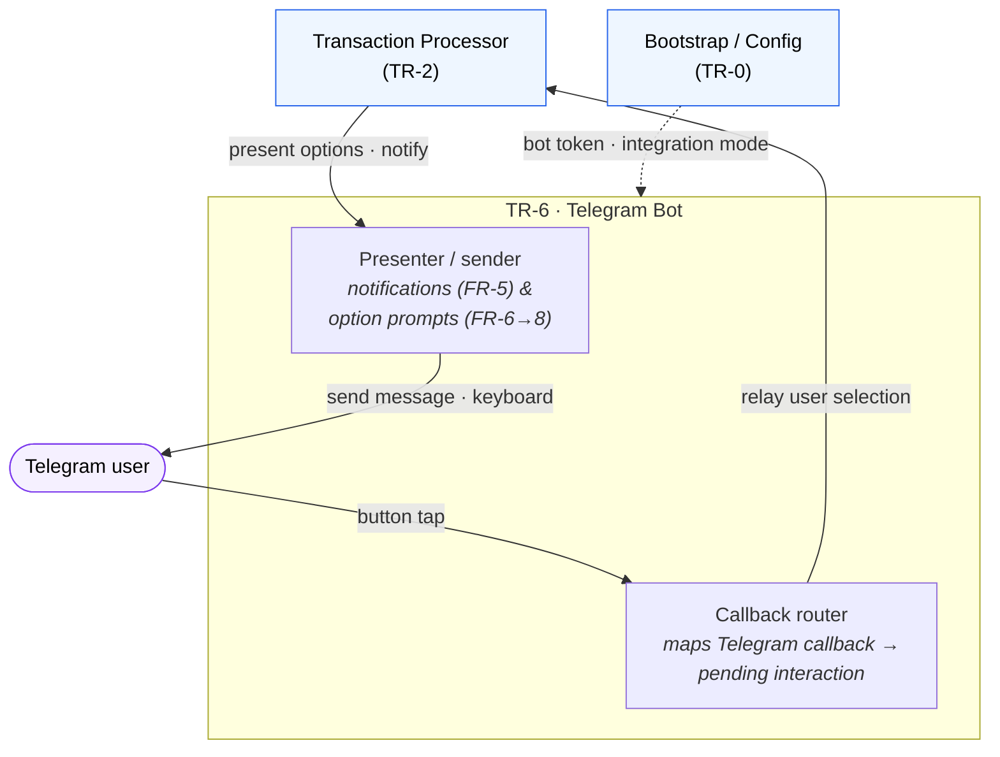

# TR-6. Telegram Bot & Conversation

> Status: Draft skeleton.

## Traceability
- Functional requirements: FR-5 (auto-categorization notification), FR-6 (unknown-merchant workflow), FR-7 (categorize workflow), FR-8 (ignore workflow)
- Non-functional requirements: NFR-6 (interactions complete within seconds)
- Architecture: [Telegram Bot](../architecture.md) (§6)

## Purpose & Scope
All user interaction, and **nothing else**. The Bot is a pure messaging surface: it
renders notifications and prompts, and reports the user's raw selections back to the
**Transaction Processor (TR-2)**, which is the sole orchestrator of every
Engine/Sheets/Cache/State call. The Bot performs no business logic and never touches
the spreadsheet, cache, engine or state directly. *(Decided — see
[architecture.md](../architecture.md); the alternative of a Bot-driven workflow was
rejected.)*

## System Decomposition
Two internal parts: a **presenter/sender** (renders notifications and option prompts)
and a **callback router** (maps a Telegram button tap back to the pending interaction
and relays the raw selection). Its only internal-system counterpart is the Processor;
it holds no workflow state beyond callback routing (that state lives in TR-2).

**Legend:** boxes inside the *TR-6* frame are the Bot's internal parts; **blue** is the
Processor; **purple** is the external Telegram user. Solid arrows are conceptual
interactions; the dashed arrow is config wiring. There are **no arrows to Engine,
Sheets, Cache or State** — the Bot is pure UI and talks only to the Processor and the
user.

## Responsibilities
- Send informational notification on automatic categorization (FR-5).
- On unknown transaction, present amount/date/description + Categorize/Ignore actions (FR-6).
- Categorize flow (FR-7): present Primary → Secondary → merchant-substring options and return each selection to the Processor (the Processor performs the Support update, cache refresh, expense write and mark-processed).
- Ignore flow (FR-8): present ignore-pattern candidates and return the selection to the Processor (which appends the pattern, refreshes cache, marks processed).

## Design Decisions
_TBD._ Candidate topics:
- **Conversation state machine:** how in-flight state (which transaction, which step, chosen Primary/Secondary) is stored, keyed (by chat/callback), and expired/timed out; survival across restarts. **Note (orchestration decision):** since the Processor (TR-2) orchestrates, the *workflow* state (step + partial selections per transaction) belongs with the Processor; the Bot holds only the mapping from a Telegram callback to the pending interaction. Confirm this split when specifying TR-2.
- Telegram integration mode: long polling vs. webhook (interacts with TR-0 FastAPI app).
- UI mechanics: inline keyboards / callback queries; mapping callbacks back to a pending transaction.
- Concurrency: multiple unknown transactions awaiting input simultaneously.

## Data Model / Contracts
_TBD._ Conversation/session record: transaction ref, current step, partial selections. Message payloads for notification (FR-5 fields) and each prompt (FR-6/7/8).

## Interfaces
- Inbound: Telegram updates (callbacks) from the user; notification + prompt requests from the Transaction Processor (TR-2).
- Outbound: **Transaction Processor (TR-2) only** — deliver the user's selections. No direct calls to Engine/Sheets/Cache/State.
- External: the Telegram platform (messages to/from the user).

## Dependencies
- TR-2 (its only orchestration counterpart), TR-0 (bot token, integration mode).

## Risks & Assumptions
- Conversation state is the main non-obvious design; FRs describe only the happy path.
- Assumes a single known chat/user (single-user design principle).

## Open Questions
- Where does conversation state live — in-memory only, or persisted (restart resilience)?
- Timeout/abandonment behavior for a workflow the user never completes?
- Does an in-flight unknown transaction block others, or run concurrently?
