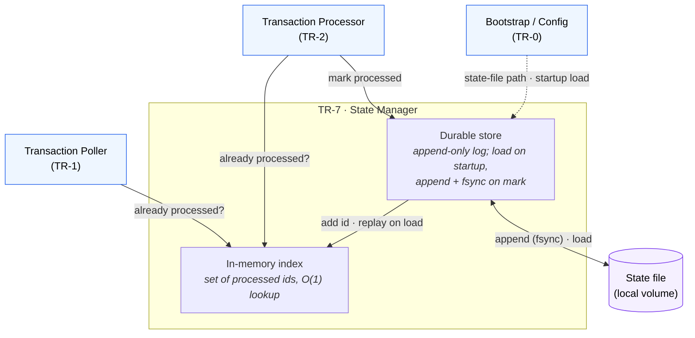

# TR-7. State Manager

> Status: Specified & **implemented** (unit-tested).

## Traceability
- Functional requirements: FR-13 (processed transaction state / idempotency)
- Non-functional requirements: NFR-3 (lightweight local runtime state), NFR-7 (single container)
- Architecture: [State Manager](../architecture.md) (§7)

## Purpose & Scope
Guarantees idempotent processing (FR-13) by tracking processed transaction identifiers
in a lightweight local file. It is the single authority for "have we handled this
transaction before?". This is **runtime state, not business data** — it is never
written to Google Sheets and can be reasoned about independently of the spreadsheet.

---

## System Decomposition
Two layers:

1. **In-memory index** — a set of processed identifiers loaded at startup; answers membership checks in O(1) with no I/O (NFR-6).
2. **Durable store** — the local state file; the in-memory index is a mirror of it. Every mark-processed appends to the store *before* the operation is considered complete (FR-13 "immediately persisted").

The in-memory index is derived state; the file is the source of truth for runtime
state and is fully reconstructable by replaying it at startup.

**Legend:** boxes inside the *TR-7* frame are the two layers; **blue** nodes are the
callers; the **purple** node is the local state file (the durability boundary). Reads
(`already processed?`) hit the **in-memory index** only; `mark processed` goes to the
**durable store** first (append + fsync) and *then* updates the index — the ordering
behind the FR-13 "immediately persisted" guarantee.

---

## Key Design Decisions

### DD-1. Append-only log format
The store is an **append-only** file, one identifier per record, rather than a
serialized set rewritten on each change. Rationale:
- FR-13 requires persisting an identifier *immediately* after each success; a single
  append is a small, near-atomic write, whereas rewriting a whole JSON blob risks
  truncation/corruption if the process dies mid-write.
- Startup load is a linear replay into the in-memory set; duplicates in the log are
  harmless (set semantics).
- Trade-off: the file grows monotonically. Bounded and acceptable at this scale
  (single user, one spreadsheet/year → hundreds–low-thousands of records/year). See
  DD-4 for rotation.

### DD-2. Durability on write
Each append is flushed and fsync'd (or an equivalent durability barrier) before
`mark_processed` returns, so "immediately persisted" (FR-13) is a real guarantee and
survives an abrupt container stop. `mark_processed` updates the in-memory set only
after the durable write succeeds.

### DD-3. Crash-consistency contract with TR-2 (accepted at-least-once window)
The overall flow is **not atomic** across Google Sheets and the local file. TR-2's
ordering is: perform the side effect (write expense to sheet **or** complete the
ignore) → then `mark_processed`. This yields:
- **No lost work / no silent drops** — a crash *before* `mark_processed` means the
  transaction is simply reprocessed next cycle.
- **Rare duplicate on crash** — if the process dies *after* the sheet write but
  *before* the append, the expense row can be written twice.

This window is **explicitly accepted** for v1: single-user, low volume, and a
duplicate row is easy to spot and delete manually. Eliminating it would require a
transactional protocol Google Sheets does not natively support. Alternatives
(pre-write intent marker, reconciliation scan) are out of scope unless the user
requests stronger guarantees — see Open Questions.

### DD-4. Retention / rotation
Because the business data is scoped to one spreadsheet per year, the state file is
**keyed to the same year** (e.g. one state file per year). On year rollover a new file
is used; old files may be retained or archived. This keeps each file small and aligns
runtime state with the yearly business boundary. Exact path scheme is a TR-0 config
concern.

### DD-5. Corruption tolerance
A malformed trailing record (e.g. a partial line from a crash mid-append) is tolerated
at load: the reader skips unparseable trailing bytes rather than failing startup.
Fully unreadable files fail loudly (misconfiguration), not silently.

---

## Data Model / Interface Contract

Persisted: a set of provider transaction identifiers (the `Transaction.id` owned by
TR-1). **Record format (decided): the plain id, one per line** — trivial replay into a
set, and a partial trailing line is a harmless bogus id (DD-5).

Public API (conceptual):

| Operation | Contract |
|-----------|----------|
| `load()` | Called once at startup, **before** any transaction is processed (FR-13). Replays the store into the in-memory set. Idempotent. |
| `is_processed(id) -> bool` | Pure in-memory membership check; no I/O. |
| `mark_processed(id)` | Durably append (DD-2), then add to the in-memory set. Safe to call with an already-present id (no-op append avoidance or harmless duplicate). |

---

## Interfaces
- **Inbound — read:** Transaction Poller (TR-1) and Transaction Processor (TR-2) call `is_processed`.
- **Inbound — write:** Transaction Processor (TR-2) and Telegram workflow (TR-6) call `mark_processed` after a successful ignore (FR-4/FR-8) or expense write (FR-5/FR-7/FR-12).
- **Outbound:** local filesystem only. No network, no Sheets.

---

## Dependencies
- TR-0 — state-file path / naming scheme, and the durable volume it lives on (Docker packaging decision, NFR-7).
- Consumed by TR-1, TR-2, TR-6.

---

## Risks & Assumptions
- ✅ **Durable volume for the state file (NFR-7)** — no longer just an assumption:
  [TR-0's Docker packaging decision](TR-0-app-bootstrap-and-configuration.md#design-decisions)
  requires a named/bind volume for `state_file_path` that survives restarts/redeploys.
  If a deployment omits it anyway, idempotency is lost across restarts — TR-0 tracks
  that as an accepted infrastructure-layer risk it cannot enforce in code.
- **Assumption:** `Transaction.id` is stable and unique. Per the [TR-1 finding](TR-1-transaction-poller.md#finding--provider-transaction-id-is-not-always-stable-affects-tr-7), some banks omit the provider `transaction_id`, in which case the poller supplies a **derived hash** (`id_is_derived = true`). A derived id is only as stable as the fields it hashes; if the bank's payload for the "same" transaction varies between polls, dedup fails and a duplicate expense can be written. **Mock-validated (2026-07-26):** against the Enable Banking Mock ASPSP — which never returns a `transaction_id` — derived ids were identical across repeated polls, so the derived-id path is the *primary* path in testing and is empirically stable there. This must still be re-validated against production Revolut.
- **Concurrency (resolved):** `mark_processed`/`is_processed` are **synchronous**, so within the single asyncio event loop a call runs to completion without yielding — no interleaving, no lock needed. (A lock would only be required if called from multiple OS threads, which the design does not do.)
- **Accepted risk:** the at-least-once duplicate window in DD-3.

---

## Open Questions
1. **Derived-id composition** — when no provider `transaction_id` exists, should the id be the raw `entry_reference` (present in the Mock ASPSP data, e.g. `p1a2b`) or the current hash of `entry_reference` + date + amount + currency + direction + description? Raw is simpler and more stable if the description shifts; the hash is more collision-resistant. Decide once Revolut's payload is known.
2. Confirm the at-least-once window (DD-3) is acceptable, or do you want a stronger guarantee (e.g. intent-marker / reconciliation)?
3. ✅ Record serialization → bare identifier, one per line.
4. Year-rollover handling (DD-4): auto-detect current year and switch files, or restart-per-year? (Owned by TR-0; `StateManager` just takes a path.)
5. Confirm the deployment provides a durable volume for the state file.

## Implementation
[`src/expenses/state/manager.py`](../../src/expenses/state/manager.py) — `StateManager(path)`
with `load()`, `is_processed(id)`, `mark_processed(id)`. Synchronous; append + `os.fsync`
before the in-memory set update (DD-2); creates the parent directory; tolerates missing
file and blank/partial lines (DD-5). Config: `EXPENSES_STATE_FILE_PATH` (default
`state/processed_transactions.log`, gitignored). Satisfies the poller's `ProcessedStore`
port. Tests in [`tests/test_state_manager.py`](../../tests/test_state_manager.py) cover
persistence across instances, idempotent marking, immediate append, and corruption
tolerance.
